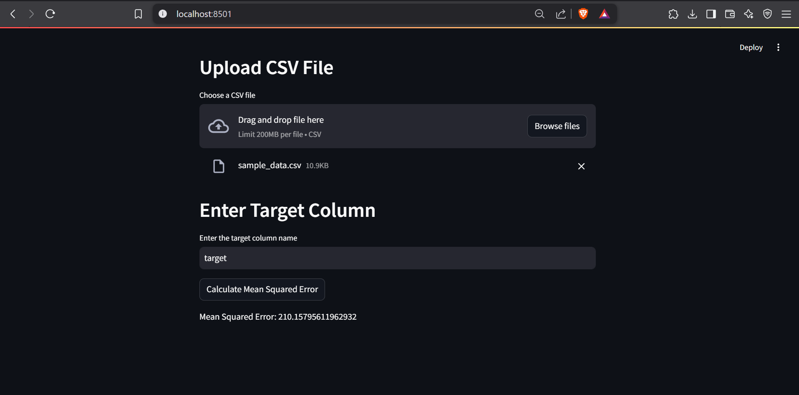

# NBForge

- Python package to convert notebooks into well structured python projects .
- Goal is to be able to process notebooks to

  - 1. Create python project with well structured modules
  - 2. Create FAST-API wrapper
  - 3. Create Streamlit frontend

- Modes of offering

  - 1. Webapp - drop the jupyter notebook and forge the project you want
  - 2. CLI
  - 3. VS-Code extension

- Milestones :

- 1. convert notebook to python project -- done
- 2. stream lit
  - to provide stream lit desc create a markdown with the header `NBForge_Streamlit`
  - if there are multiple such markdown blocks we pick the latest one
- 2. proper structure
  - add description for each function
- 3. add logging
- 4. proper packaging (toml)
- 5. convert to package
  - understand difference between
    - a. publishing a package that one can import
    - b. publishing a pakcage that people install and use in cli
- 6. cli
- 7. webapp
- 8. vs code extension

- MAYBE : we will provide an option to create test cases for the modules
- add anotations :

  - through comments probably
  - user can state whether to add this markdown as comment or as as main readme

- if we are offering as cli then how to use the groq api key?

### Tasks

- revamp the prompt

  - make sure llm does not add anything of its own
  - it just goes over the code and separates the code and comments
  - should we allow it to revamp the comments and readme?

- check the streamlit app . check whether it is correctly picking the csv file .

- Sample image from streamlit app
- 
- 
